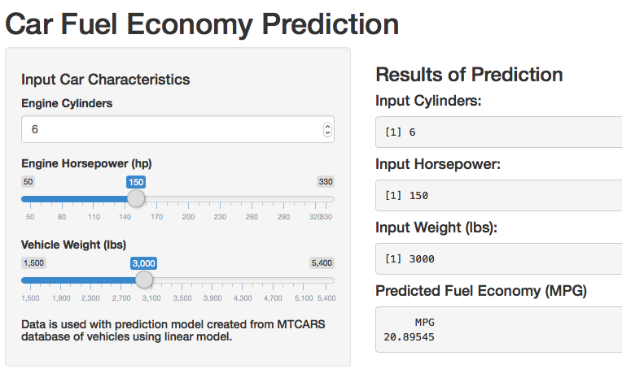

## Need for Fuel Economy Prediction

Fuel economy is a very important factor in choosing a car.  FOr some it is the most important factor.  This tool is to provide a way for customers to choose what characteristics they want in a car before purchasing. 

Source data is from the Motor Trend magazine dataset from 1974.  This data set has 32 cars and their characteristics.

```{r}
dat <- mtcars
```

--- .class #id 

## Tool Prediction Model

For this tool a model is made using a linear regression in R.  First the most imporant factors must be chosen.  An example of the data set is shown below.

```{r}
dat[1,]
```

Tyoically in cars fuel economy is driven by three factors, the number of cylinders in the engine, the engine power output, and the total vehicle weight.  From this a regression is made.

```{r}
mtModel <- lm(mpg ~ hp + wt + cyl, data=dat)
```

---

## Model Check

Now the model can be checked to see if it appropreate and represents the data well.

```{r}
summary(mtModel)
```

While the model is not very good of a fit due to the variables it is enough to provide customers with some idea of how the main factors affect the performance of their vehicles.


---

## Using the Model

The model is [available online here](http://monkeyfett8.shinyapps.io/project/) and looks like the image below.



---

## Using model (cont.)

On the left side of the tool are the 3 input values, cylinders, power, and weight.  These can be adjusted on the fly.  On the right is an output of the registered input values and the predictionoutput from the Fuel Economy model.  This prediction will update in real time with the inputs.